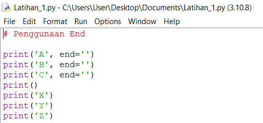
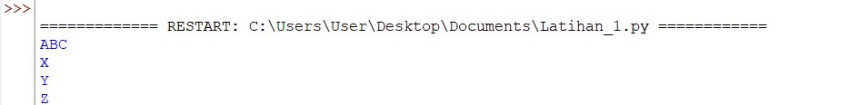
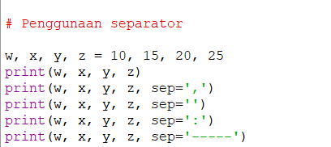
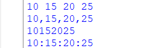
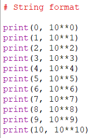
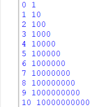
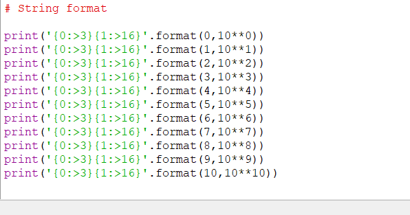
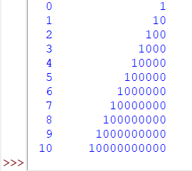
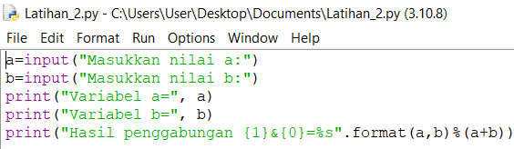

# praktikum 3
## latihan 1 
### penggunaan end 
#### - penggunaan end pada python berfungsi sebagai parameter pemisah


## penggunaan separator
#### - penggunaan separator pada python berfungsi sebagai pemisah setiap variabel yang telah diberi nilai


## string format
#### - string formatting atau pemformatan string memungkinkan kita menyuntikan item ke dalam string daripada kita mencobamenggabungkan string menggunakan koma atau string concatenation .


#### - ini adalah contoh string contatenation 


## latihan 2
#### - tentukan variabel terlebih dahulu, saya memakai dua variabel, yaitu a dan b
#### - beri inputan pada variabel
#### - setelah di beri input, ekspresikan variabel yang telah diberi inputan 
#### - lalu kita mencoba menggabungkan variabel a dan b dengan formatting string 

### konversi nilai variabel
#### - Konversi nilai variabel yang masih berbentuk 'string' pada 'intreger'
#### - Setelah itu menjumlahkan dan membagi dengan mengepresikan dalam bentuk *Formatting String*


## Latihan 3
### Buatlah kode program menggunakan string formattting untuk menghasilkan output seperti gambar dibawah ini

```
print('{:>11}'.format(" * "))
print('{:>13}'.format(" * * * "))
print('{:>15}'.format(" * * * * * "))
print('{:>17}'.format(" * * * * * * * "))
print('{:>19}'.format(" * * * * * * * * * "))
print('{:>17}'.format(" * * * * * * * "))
print('{:>15}'.format(" * * * * * "))
print('{:>13}'.format(" * * * "))
print('{:>11}'.format(" * "))
```

## Praktikum 3 

### Hasil praktikum 3 yang telah saya lakukan yaitu :
#### - Dapat memahami algoritma lingkarang yang diproses dalam Python
#### - Dapat menjelaskan bagaimana langkah-langkah membuat algoritma lingkaran pada Python
#### - Dapat membuat *Flowchart* algoritma dengan baik dan benar
#### - Dapat mengoperasikan langsung algoritma lingkarang pada Python

